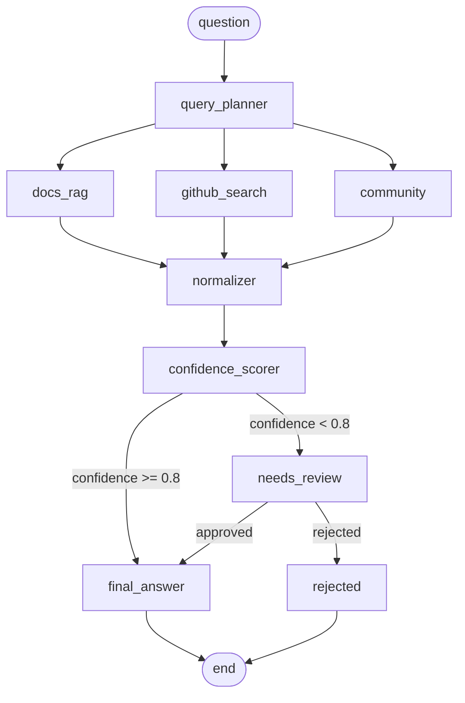

# dd-agent - AI Due Diligence Agent

LangGraph prototype that answers integration questions (e.g. "Should we integrate
Stripe Connect?") by retrieving evidence in parallel from three sources, scoring
confidence with a rubric, and pausing for human approval when confidence is low.

Built TDD per [docs/langgraph-agent-plan.md](docs/langgraph-agent-plan.md).

## Architecture



See [docs/graph.mmd](docs/graph.mmd) for the source. State is a typed
pydantic model (`dd_agent/schema.py`); checkpoints persist to SQLite so runs
survive process restarts.

## Setup

```bash
pip install -e .
pip install -e ".[dev]"
```

## Environment variables

| Variable           | Required | Purpose                                        |
| ------------------ | -------- | ---------------------------------------------- |
| `GROQ_API_KEY`     | Yes      | LLM calls (planning, sub-scores, answers)      |
| `GITHUB_TOKEN`     | No       | GitHub search auth (avoids rate limiting)      |

Copy `.env.example` to `.env` and fill in your keys; the CLI loads it
automatically.

## How to run

```bash
python -m scripts.build_docs_index        # build local docs chunk index (once)
python -m dd_agent.cli "Should we integrate Stripe Connect?"
```

The CLI streams each node's output as it arrives, shows the confidence
breakdown, pauses with `[y/N]` for human approval when confidence < 0.8, and
prints the final recommendation. Runs are persisted in `checkpoints.db` and
retrieval results are cached in `query_cache.db`.

## How to test

```bash
pytest                      # full suite with coverage (target: ≥80% overall)
pytest tests/test_graph.py  # single file
```

## Modules

- `schema.py` - `Evidence`, `ConfidenceBreakdown`, `ReviewRequest`, `AgentState` (typed, validated)
- `confidence.py` - deep scoring module: `score(items, llm) -> ConfidenceBreakdown` (drops unparseable items)
- `nodes/` - `docs_rag` (local index), `github_search` / `community` (thin wrappers over shared `retrieval.py`), `query_planner`, `normalizer`, `http_retry`
- `graph.py` - LangGraph wiring: parallel fan-out, confidence gate, approval interrupt
- `runner.py` - `run(graph, question)` / `RunResult.resume(approved)` wrapper
- `compose.py` - composition root: env, paths, adapters
- `checkpoint.py` / `cache.py` - SQLite persistence (source-scoped query cache)
- `llm.py` - `GroqLLM` chat completions wrapper
- `cli.py` - streaming terminal renderer
- `export.py` - mermaid diagram + markdown citation export
